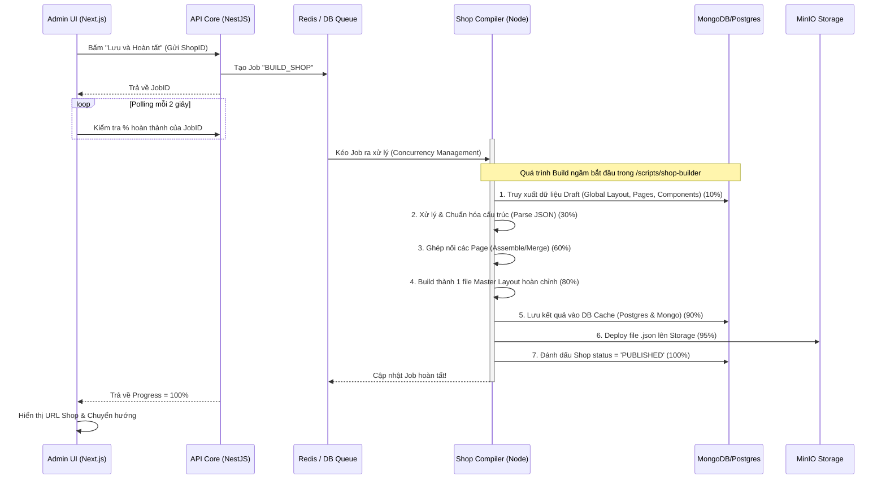

# Kế Hoạch Kiến Trúc: Script Tự Động Tạo Shop Chạy Nền (Background Worker)

Dựa trên nguyên tắc tối ưu bộ nhớ (Limit 64GB RAM), việc tạo Shop (Compile & Build Website) sẽ được tách hoàn toàn ra khỏi API Server chính (NestJS) và giao cho một **Worker Process độc lập** (tất cả các file script được đặt trong folder `/scripts/shop-builder`) xử lý thông qua **Message Queue** (hàng đợi).

## 1. Sơ đồ Hoạt động (Mermaid Diagram)

## 2. Tổ chức Script và Code (Resource Optimization)

Để tận dụng tối đa mức tài nguyên (64GB RAM) và xử lý khối lượng JSON khổng lồ khi compile website, hệ thống Worker sẽ chia thành **1 file Runner chính** và các **Module xử lý riêng biệt** nằm trong thư mục `scripts/shop-builder/`. Khó khăn cốt lõi ở đây là thuật toán ghép nối (Assemble) các trang và component thành một thể thống nhất.

### Cấu trúc File đề xuất:

1. `scripts/shop-builder/worker.ts` **(File Main)**
   - Nhiệm vụ: Chạy tiến trình độc lập, lắng nghe Message Queue.
   - Quản lý trạng thái Job (Cập nhật % tiến độ).
   - Truyền dữ liệu vào các bước Compiler.

2. `scripts/shop-builder/pipeline/01-data-extractor.ts`
   - Nhiệm vụ: Kéo toàn bộ dữ liệu Draft của Shop từ Database (Global Settings, danh sách các Page, Navigation, Component Props...).
   - Validation kiểm tra tính hợp lệ của dữ liệu trước khi build.

3. `scripts/shop-builder/pipeline/02-page-assembler.ts` **(Core Logic)**
   - Nhiệm vụ: Đây là bước khó nhất. Lắp ghép các block rời rạc thành một trang web hoàn chỉnh.
   - Kết hợp `Global Components` (Header, Footer) vào từng `Page` (Home, Product, Cart).
   - Xử lý các liên kết động (Dynamic links) từ Navigation đã thiết lập.

4. `scripts/shop-builder/pipeline/03-layout-compiler.ts`
   - Nhiệm vụ: Chuẩn hóa toàn bộ cấu trúc vừa ghép nối thành 1 file Master JSON duy nhất đúng chuẩn Schema (`BaseLayout`).

5. `scripts/shop-builder/pipeline/04-storage-publisher.ts`
   - Nhiệm vụ: Ghi JSON Layout vào PostgreSQL Cache và đẩy file lên MinIO. Cập nhật trạng thái Shop thành `PUBLISHED`.

## 3. Quản lý Tài nguyên (64GB RAM Limit)

- **Xử lý JSON dung lượng lớn:** Các file layout JSON khi ghép lại có thể lên tới vài MB mỗi shop. Việc phân bổ RAM 64GB cho phép Worker nạp và compile song song hàng chục shop cùng lúc (High Concurrency) mà không sợ nghẽn cổ chai.
- **Tối ưu vòng lặp:** Quá trình duyệt cây Component (Tree Traversal) trong bước `page-assembler` sẽ được viết tối ưu (tránh Deep Clone không cần thiết nếu cấu trúc quá sâu) để giảm áp lực lên Garbage Collector của Node.js.
